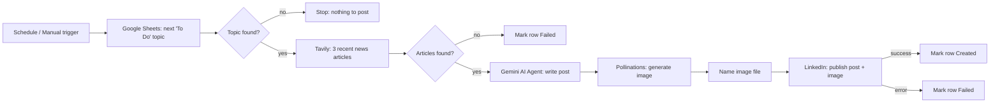

# AI LinkedIn Auto-Poster (n8n)

An [n8n](https://n8n.io) workflow that turns one Google Sheet row into a researched, illustrated LinkedIn post and publishes it automatically.

**Topic in a sheet → 3 fresh news articles → one original post → matching image → published on LinkedIn → sheet updated.**

<!-- Add a screenshot of your workflow canvas: assets/workflow-canvas.png -->
<!--  -->

## How it works



| Step | Node | What it does |
|---|---|---|
| 1 | Schedule / Manual Trigger | Runs every 12 hours (edit to taste) or on demand for testing |
| 2 | Get row(s) in sheet | Returns the first row where `Status = To Do` |
| 3 | Has pending topic? | Stops cleanly if the sheet has no `To Do` rows |
| 4 | Tavily Search | Fetches 3 recent news articles about the topic |
| 5 | Has articles? | If nothing is found, marks the row `Failed` instead of letting the model invent a post |
| 6 | AI Agent (Gemini) | Synthesises the articles into one original 150–250 word post |
| 7 | Generate Image (Pollinations) | Creates a matching 1024×1024 image with the Flux model |
| 8 | Name the File | Names the image after the topic and validates that it really is an image |
| 9 | Create a post (LinkedIn) | Publishes the text + image to your profile |
| 10 | Mark row Created / Failed | Writes the result (and the post text) back to the sheet |

## Requirements

| Service | Used for | Credential type in n8n | Get it from |
|---|---|---|---|
| n8n (Cloud or self-hosted) | Runs the workflow | – | https://n8n.io |
| Google Sheets | Topic queue + status log | Google Sheets OAuth2 API | Connect via n8n |
| Google Gemini | Writes the post | Google Gemini (PaLM) API | API key from Google AI Studio |
| Tavily | News search | Header Auth | https://app.tavily.com |
| Pollinations | Image generation | Header Auth | https://enter.pollinations.ai |
| LinkedIn | Publishing | LinkedIn OAuth2 API | LinkedIn Developer Portal |

> Each service has its own pricing/free-tier limits that change over time. Check them before scheduling daily runs.

## Repository structure

```
n8n-ai-linkedin-autoposter/
├── README.md
├── LICENSE
├── .gitignore
├── workflows/
│   └── ai-linkedin-autoposter.json     # importable n8n workflow (no secrets)
├── sample-data/
│   └── topics-template.csv             # starter Google Sheet
└── assets/
    └── (workflow-canvas.png)           # add your screenshot here
```

## Setup

### 1. Create the Google Sheet

Import [`sample-data/topics-template.csv`](sample-data/topics-template.csv) into a new Google Sheet (File → Import). Keep these exact column headers (no trailing spaces):

| Topic | Status | Content |
|---|---|---|
| AI agents in customer support | To Do | *(filled in by the workflow)* |

- `Status` must be exactly `To Do` for a row to be picked up. The workflow sets it to `Created` or `Failed`.
- Rows are processed top to bottom, one per run.
- Copy the **Sheet ID** from the URL: `https://docs.google.com/spreadsheets/d/<SHEET_ID>/edit`.

### 2. Import the workflow

n8n → **Workflows → ⋯ → Import from file** → choose `workflows/ai-linkedin-autoposter.json`.

### 3. Create the credentials

**Google Sheets** – create a *Google Sheets OAuth2 API* credential and click *Sign in with Google*.

**Google Gemini** – create an API key in Google AI Studio, then add a *Google Gemini (PaLM) API* credential.

**Tavily** – create a *Header Auth* credential named `Tavily Header Auth`:
- Name: `Authorization`
- Value: `Bearer tvly-YOUR_KEY`

**Pollinations** – create a *second, separate* *Header Auth* credential named `Pollinations Header Auth`:
- Name: `Authorization`
- Value: `Bearer sk_YOUR_KEY`

> Tavily and Pollinations must not share one credential. A Header Auth credential stores a single key, so sharing it makes one of the two APIs return 401.

**LinkedIn**
1. Create an app in the [LinkedIn Developer Portal](https://developer.linkedin.com/) (it must be associated with a LinkedIn Page).
2. On the **Products** tab request **Share on LinkedIn** and **Sign In with LinkedIn using OpenID Connect**.
3. Copy the redirect URL shown in n8n's credential dialog into the app's **Auth** tab → *Authorized redirect URLs*.
4. In n8n add a **LinkedIn OAuth2 API** credential, paste the Client ID and Client Secret, and click *Connect*.

### 4. Wire the credentials into the workflow

| Node | Credential |
|---|---|
| Get row(s) in sheet, Mark row as Created, Mark row as Failed, Mark row as Failed (no articles) | Google Sheets OAuth2 |
| Tavily Search | Tavily Header Auth |
| Google Gemini Chat Model | Google Gemini (PaLM) API |
| Generate Image (Pollinations) | Pollinations Header Auth |
| Create a post | LinkedIn OAuth2 |

Then:
- Paste your Sheet ID into the **Document** field of all four Google Sheets nodes (mode *By ID*).
- Open **Create a post** and select your profile in **Person Name or ID**.

### 5. Test, then activate

1. Add one row with `Status = To Do`.
2. Click **Execute workflow** from *Manual Trigger (test)* and inspect each node's output.
3. Check your LinkedIn profile and confirm the row changed to `Created`.
4. Toggle the workflow to **Active**.

## Customisation

| I want to… | Change this |
|---|---|
| Post once a day at a fixed time | Schedule Trigger → *Every Day*, set the hour (and the workflow timezone in Settings) |
| Change tone, length or structure | `AI Agent` → System Message |
| Change the image style | `Generate Image (Pollinations)` → URL prompt text |
| Widen or narrow the news window | `Tavily Search` → `time_range` (`day`, `week`, `month`, `year`) |
| Use more or fewer articles | `Tavily Search` → `max_results` |
| Use a different model | `Google Gemini Chat Model` → Model |

## Design notes

- **Generate the image after the AI Agent.** The agent node forwards only its text output, so any binary file created before it is dropped and LinkedIn fails with *"expects the node's input data to contain a binary file 'data'"*.
- **Always filter on `Status = To Do`.** Without the filter, "first row" is always row 1 and the same post is published repeatedly.
- **Stop when search returns nothing.** With no sources, an LLM will still write a confident post. The `Has articles?` guard prevents that.
- **Scraped article text is untrusted.** The system prompt tells the model to ignore instructions embedded in articles.
- **Literal `\n` and `**bold**`** sometimes appear in model output; the post text expression cleans both before publishing.

## Troubleshooting

| Symptom | Likely cause / fix |
|---|---|
| `expects … binary file 'data'` on *Create a post* | The image step failed or was moved before the AI Agent. Keep the order Agent → Pollinations → Name the File → LinkedIn |
| 401 on Tavily | Header must be `Authorization: Bearer tvly-…` and must be a separate credential from Pollinations |
| 401 / 402 on Pollinations | Wrong or missing key, or your credits are exhausted |
| Workflow ends with red *No Pending Topics* | Expected when no row has `Status = To Do` |
| No row is ever found | Column headers must be exactly `Topic`, `Status`, `Content`; status must be exactly `To Do` |
| `unauthorized_scope_error` (`w_organization_social`) | Use the **LinkedIn OAuth2 API** credential (not *Community Management*) and make sure the app has both products enabled |
| LinkedIn worked, then started returning 401 | LinkedIn access tokens expire (typically after about 60 days). Reconnect the credential |
| Same post appears twice | Check that *Mark row as Created* succeeded, and that only one copy of the workflow is active |

## Security and responsible use

- **Never commit API keys.** This repo ships without credentials; keep your own credentialed exports in a git-ignored `private/` folder.
- **Review before you automate.** Run manually for a while and read every post. You are responsible for what is published under your name.
- **Follow platform rules.** This workflow uses LinkedIn's official API through OAuth. Check LinkedIn's API terms and your own disclosure preferences for AI-assisted content.
- Model output can be wrong. Verify facts for anything sensitive or client-facing.

## Ideas for next versions

- Human approval step (Telegram / Slack / email) before publishing
- Multiple post formats (carousel, poll, article link)
- Duplicate-topic detection and a retry column
- Company Page posting (requires LinkedIn Community Management approval)

## Author

**Muhammad Nadeem** — AI Automation Consultant / Workflow Engineer
GitHub: `https://github.com/Kashan474` · LinkedIn: `https://www.linkedin.com/in/muhammad-nadeem-38496b10a/`

## License

[MIT](LICENSE)
