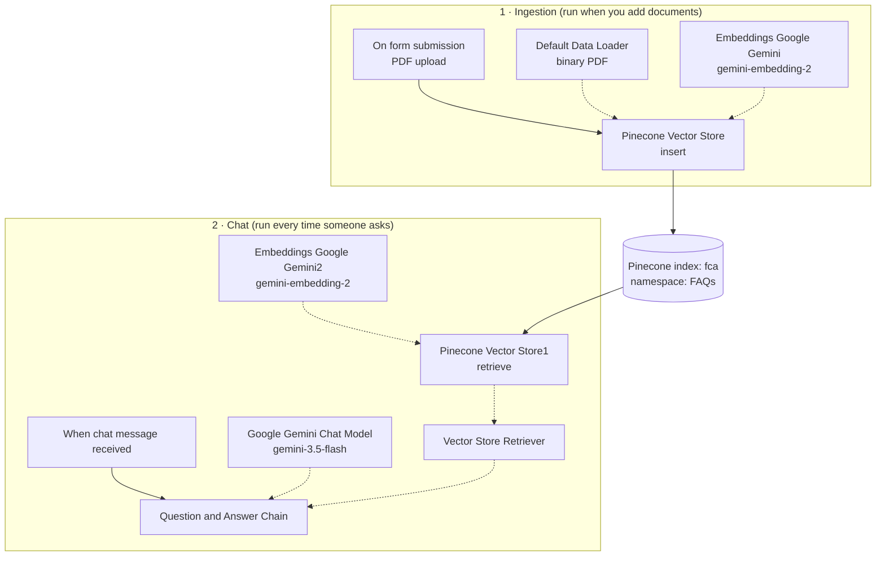

# Pinecone RAG Chatbot with Gemini Embeddings (n8n)

An [n8n](https://n8n.io) workflow that builds a **document-grounded chatbot** in two steps. First, upload a PDF through a web form. It is embedded with **Google Gemini** and stored in a **Pinecone** vector index. Then chat with a Gemini-powered Question & Answer chain that retrieves the most relevant chunks from that index and answers only from them.

Built for **Flying Colors Academy (FCA)** to answer FAQ-style questions from its documents, but it works for any PDF knowledge base (policies, prospectuses, manuals, datesheets).


---

## How it works

The workflow has two independent flows on one canvas.



| Flow | Steps |
|---|---|
| **1. Ingestion** | Upload a PDF in the form → the Default Data Loader reads the binary file → Gemini creates embeddings → chunks are inserted into the Pinecone index |
| **2. Chat** | User sends a message in the n8n chat → the question is embedded → Pinecone returns the closest chunks → Gemini writes an answer using only that context |

## Node reference

| Node | Type | Purpose |
|---|---|---|
| On form submission | Form Trigger | Upload form with a single file field |
| Default Data Loader | Default Data Loader | Reads the uploaded file as **binary → PDF** |
| Embeddings Google Gemini | Embeddings Google Gemini | Converts document chunks to vectors (`gemini-embedding-2`) |
| Pinecone Vector Store | Pinecone Vector Store | **Insert** mode into index `fca`, namespace `FAQs` |
| When chat message received | Chat Trigger | Chat interface for asking questions |
| Question and Answer Chain | Retrieval Q&A Chain | Combines retrieved context with the question |
| Google Gemini Chat Model | Google Gemini Chat Model | Answer-generating LLM (`gemini-3.5-flash`) |
| Vector Store Retriever | Vector Store Retriever | Fetches relevant chunks for the chain |
| Pinecone Vector Store1 | Pinecone Vector Store | Read side of the same index and namespace |
| Embeddings Google Gemini2 | Embeddings Google Gemini | Embeds the user's question (`gemini-embedding-2`) |

### System prompt (Question and Answer Chain)

```text
You are an assistant for question-answering tasks. Use the following pieces of retrieved context to answer the question.
If you don't know the answer, just say that you don't know, don't try to make up an answer.
----------------
Context: {context}
```

## Prerequisites

- An n8n instance (n8n Cloud or self-hosted) with the AI/LangChain nodes
- A [Google Gemini API key](https://aistudio.google.com/apikey)
- A [Pinecone](https://www.pinecone.io) account and API key
- A Pinecone index (the workflow expects one named `fca`) whose **dimension matches the embedding model's output**

## Setup

1. **Create the Pinecone index** named `fca` (or choose your own name and update both Pinecone nodes). Set its dimension to match the output of `gemini-embedding-2`.
2. **Import the workflow**: in n8n go to *Workflows → Import from File* and select [`workflows/pinecone-vector-store-gemini-embedding.json`](workflows/pinecone-vector-store-gemini-embedding.json).
3. **Connect credentials** (they are not included in the export):

   | Node(s) | Credential |
   |---|---|
   | Embeddings Google Gemini, Embeddings Google Gemini2, Google Gemini Chat Model | Google Gemini (PaLM) API |
   | Pinecone Vector Store, Pinecone Vector Store1 | Pinecone API |

4. **Check the Pinecone nodes**: both must use the **same index and namespace** (`fca` / `FAQs` by default).
5. **Ingest a document**: run the form trigger, upload a PDF and wait for the run to finish.
6. **Chat**: open the chat trigger (*Open chat*) and ask a question about the document.

## Important notes

- **Use the same embedding model for ingestion and chat.** Vectors from different models are not comparable, so both embedding nodes use `gemini-embedding-2`. If you change one, re-ingest your documents.
- **Data Loader type must be Binary.** If it is left on JSON, the PDF text is never extracted and the chatbot replies that it has no information.
- **PDF only.** The loader is set to PDF. For DOCX, TXT or CSV, change the loader type.
- **Answers are only as good as the ingested documents.** Upload clean, text-based PDFs (scanned images need OCR first).

## Ideas for improvement

- Add a **Text Splitter** (for example Recursive Character) to the Default Data Loader to control chunk size and overlap.
- Add **Simple/Redis Memory** to the Q&A flow for follow-up questions. Note that the Retrieval Q&A chain has no memory by default.
- Replace the Chat Trigger with WhatsApp, Slack or Telegram triggers to serve the same knowledge base on other channels.
- Add a metadata field (document name, date) so answers can cite their source.

## Related projects

The same Pinecone index (`fca`, namespace `FAQs`) can be queried as a retrieval tool by an AI agent. See the [`MCP-agents`](../MCP-agents) project.

## Repository structure

```text
.
├── README.md
├── docs/
│   └── workflow-overview.jpg
└── workflows/
    └── pinecone-vector-store-gemini-embedding.json
```

## Security

Credentials, webhook IDs and instance identifiers have been removed from the exported JSON. Re-attach your own credentials after importing, and never commit API keys.
