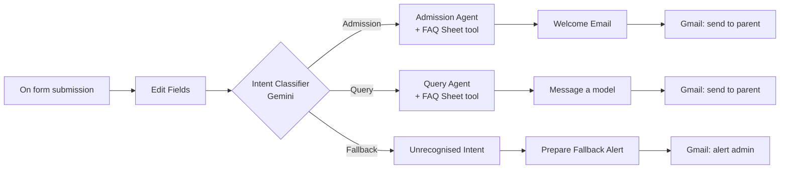

# Flying Color Academy – AI Inquiry Email Automation (n8n)

An [n8n](https://n8n.io) workflow that turns a website inquiry form into instant, personalised email replies. Each submission is classified by **Google Gemini** into *Admission*, *Query* or *Fallback*. AI agents then look up accurate answers in a **Google Sheets FAQ** and send a formatted HTML reply through **Gmail**. Anything the AI can't classify is forwarded to an admin for manual follow-up.

Built for **Flying Color Academy**, a tuition academy serving Grade 3–10 students across Oxford, Cambridge, Federal Board and Government Board curricula.


---

## Features

- **Form-triggered** – parents/students submit Name, Email, Grade, Curriculum and Message.
- **AI intent routing** – Gemini classifies each message as `Admission`, `Query` or `Fallback`.
- **FAQ-grounded answers** – agents must query the FAQ sheet first and are instructed not to invent fees, timings or details.
- **Structured output** – each agent returns a `subject` and an HTML `message` (enforced by a JSON schema), ready to send.
- **Safe fallback** – vague messages ("Hi", "Test", "OK") never get an AI reply; the admin gets an alert with the submission details instead.

## How it works



| Branch | Trigger condition | What happens |
|---|---|---|
| **Admission** | Enrolment, registration, fees, admission process | Admission Agent looks up the FAQ sheet and writes a personalised welcome email (mentions grade, curriculum, next steps such as a free assessment) → sent to the submitter |
| **Query** | General question about the academy | Query Agent answers from the FAQ sheet; if the answer isn't there it says the team will follow up → sent to the submitter |
| **Fallback** | Greeting, vague, irrelevant or empty message | No reply to the submitter. An alert email with all form details is sent to the admin |

## Node reference

| Node | Type | Purpose |
|---|---|---|
| On form submission | Form Trigger | Public inquiry form (5 required fields) |
| Edit Fields | Set | Normalises fields to `name`, `email`, `grade`, `curriculum`, `query` |
| Intent Classifier | Text Classifier | Routes to Admission / Query / Fallback |
| Gemini for Classifier | Google Gemini Chat Model | LLM for the classifier (`gemini-2.5-flash`) |
| Admission Agent | AI Agent | Writes the admission welcome email |
| Query Agent | AI Agent | Writes the general-query reply |
| Google Gemini Chat Model / Model1 | Google Gemini Chat Model | LLMs for the agents (`gemini-2.5-flash` and `gemini-3.1-flash-lite`) |
| Structured Output Parser / Parser1 | Structured Output Parser | Forces `{ subject, message }` JSON output |
| Flying_Color_Academy_FAQ / FAQ1 | Google Sheets Tool | Lets each agent read the FAQ sheet |
| Welcome Email / Message a model | Set | Maps `email`, `subject`, `message` for Gmail |
| Send a message / Send a message1 | Gmail | Sends the AI-written reply to the submitter |
| Unrecognised Intent | No-Op | Fallback branch entry point |
| Prepare Fallback Alert | Set | Builds the admin alert email |
| Alert Admin | Gmail | Sends the alert to the admin address |

The full prompts are documented in [`docs/prompts.md`](docs/prompts.md).

## Tech stack

n8n (AI Agent, Text Classifier, Form Trigger) · Google Gemini API · Google Sheets API · Gmail API

## Prerequisites

- An n8n instance (n8n Cloud or self-hosted) with the LangChain/AI nodes available
- A [Google Gemini API key](https://aistudio.google.com/apikey)
- A Google account with Gmail and Google Sheets enabled (OAuth2 credentials in n8n)
- A Google Sheet containing your FAQs

## Setup

1. **Import the workflow**
   In n8n: *Workflows → Import from File* → select [`workflows/flying-color-academy-gmail-automation.json`](workflows/flying-color-academy-gmail-automation.json).

2. **Create the FAQ sheet**
   Make a Google Sheet with a tab named `Advanced FAQs` and a header row (for example `Question`, `Answer`), then fill in your fees, admission process, grades, curricula, timings, etc. The agents only use what is in this sheet.

3. **Connect credentials** (credentials are not included in the export)

   | Node(s) | Credential to create |
   |---|---|
   | Gemini for Classifier, Google Gemini Chat Model, Google Gemini Chat Model1 | Google Gemini (PaLM) API |
   | Flying_Color_Academy_FAQ, Flying_Color_Academy_FAQ1 | Google Sheets OAuth2 |
   | Send a message, Send a message1, Alert Admin | Gmail OAuth2 |

4. **Update placeholders**

   | Node | Field | Set to |
   |---|---|---|
   | Flying_Color_Academy_FAQ / FAQ1 | Document | Your Google Sheet (replace `YOUR_GOOGLE_SHEET_ID`) |
   | Alert Admin | Send To | Your admin email (replace `admin@example.com`) |

5. **Test** – click *Execute workflow*, open the form's test URL, and submit one admission-style message, one general question and one vague message ("hello") to verify all three branches.

6. **Activate** – toggle the workflow to *Active* and share the production form URL.

## Customisation

- **Different institute?** Edit the system prompts in the two agents and the classifier, and swap the FAQ sheet.
- **Change email tone/length** – edit the `STRICT OUTPUT RULES` in each agent's system message.
- **Different model** – change the model in the Gemini nodes (the two agents currently use different models).
- **Save leads** – add a Google Sheets *Append Row* node after *Edit Fields* to log every inquiry.

## Repository structure

```text
.
├── README.md
├── docs/
│   ├── prompts.md                # Readable copy of all AI prompts
│   └── workflow-overview.jpg     # Screenshot of the n8n canvas
└── workflows/
    └── flying-color-academy-gmail-automation.json   # Importable n8n workflow
```

## Notes

- Credentials, webhook IDs, the Google Sheet ID and the admin email have been removed from the exported JSON. Re-link them after importing.
- AI-generated replies are only as accurate as the FAQ sheet. Review the first few outputs before going live.
- The Fallback branch does not email the submitter; consider adding an acknowledgement message if you want every person to get a response.

## License

Add a license of your choice (e.g. [MIT](https://choosealicense.com/licenses/mit/)) before publishing.
