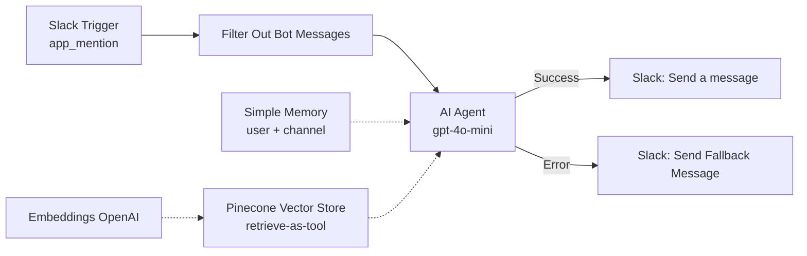

# HR Policy Assistant: Slack RAG Bot (n8n)

An [n8n](https://n8n.io) workflow that turns Slack into an **internal HR helpdesk**. Employees @mention the bot with a question, and an AI agent searches the company's policy documents stored in **Pinecone**, then replies in the same Slack channel using only the retrieved policy text. If anything fails, a friendly fallback message is sent instead of a silent error.

The demo uses a sample company, **NovaCore**, with leave policy, workplace conduct and other HR rules. Swap in your own documents to reuse it for any organisation.


---

## Features

- **Slack-native** – triggered by `@bot` mentions in a channel.
- **Grounded answers (RAG)** – the agent must call the Pinecone tool for any policy question and is instructed never to guess or invent policy details.
- **Conversation memory** – remembers the last 15 messages per employee per channel, so follow-up questions work.
- **Loop protection** – filters out messages from bots so the assistant never replies to itself.
- **Graceful failure** – if the agent errors (API failure, timeout), a fallback message directs the employee to HR.

## How it works



| Step | What happens |
|---|---|
| 1 | An employee mentions the bot in Slack |
| 2 | **Filter Out Bot Messages** drops any event that has a `bot_id` |
| 3 | The **AI Agent** receives the message text and checks memory for earlier context |
| 4 | The agent calls the **Pinecone tool** (index `novacore`, namespace `Employee_Policies`) to retrieve matching policy text |
| 5 | Using only that text, the agent writes a concise answer |
| 6 | **Send a message** posts the reply to the Slack channel. On error, **Send Fallback Message** posts a "try again or contact HR" note |

## Node reference

| Node | Type | Purpose |
|---|---|---|
| Slack Trigger | Slack Trigger | Fires on `app_mention` events in the chosen channel |
| Filter Out Bot Messages | Filter | Keeps only events where `bot_id` is empty (prevents echo loops) |
| AI Agent | AI Agent | Orchestrates memory, tool use and the answer. Has an error output for failures |
| OpenAI Chat Model | OpenAI Chat Model | LLM (`gpt-4o-mini`) |
| Simple Memory | Window Buffer Memory | Session key `{user}_{channel}`, 15-message window |
| Pinecone Vector Store | Pinecone (retrieve-as-tool) | Searches the HR policy index |
| Embeddings OpenAI | OpenAI Embeddings | Embeds the question for the vector search |
| Send a message | Slack | Posts the agent's answer |
| Send Fallback Message | Slack | Posts an apology and HR-contact hint when the agent fails |

### Agent system prompt

```text
You are NovaCore's internal HR assistant. Your job is to give accurate, concise, and helpful answers to employee questions about company policies.

## Tool Usage
You have access to a Pinecone Vector Store tool containing NovaCore's official employee policy documents (leave policy, workplace conduct, code of behavior, and related HR rules and regulations).

- Always call the Pinecone Vector Store tool whenever a question relates to employee policies, rules, regulations, leave, attendance, conduct, benefits, or workplace behavior — even if you think you already know the answer. Never answer policy questions from memory alone.
- Base your answer strictly on the information returned by the tool. Do not add details, assumptions, or numbers that are not present in the retrieved content.
- If the tool returns no relevant information, say so clearly and suggest the employee contact HR directly — do not guess or fabricate a policy.

## Response Style
- Keep answers clear, professional, and to the point — avoid unnecessary padding.
- When a policy has specific numbers, timeframes, or conditions (e.g., "12 paid leaves per year"), state them exactly as retrieved.
- If a question is ambiguous, ask a brief clarifying question before answering.
- If a question is unrelated to NovaCore policies (general knowledge, small talk, etc.), you may answer normally without using the tool.
```

## Prerequisites

- An n8n instance (n8n Cloud or self-hosted)
- A **Slack workspace** where you can create an app
- An **OpenAI API key**
- A **Pinecone** account with an index already filled with your policy documents

## Setup

1. **Populate Pinecone first.** This workflow only *reads* from the index. Ingest your policy PDFs into an index (default `novacore`) under namespace `Employee_Policies` using **OpenAI embeddings**. The ingestion and query embedding models must be the same, and the index dimension must match the model.
2. **Create a Slack app** and install it to your workspace. Enable event subscriptions for `app_mention`, grant the bot scopes to read mentions and post messages, and **invite the bot to the channel**. See n8n's Slack credential docs for the exact steps.
3. **Import the workflow**: *Workflows → Import from File* → [`workflows/novacore-hr-policy-assistant-slack-rag-bot.json`](workflows/novacore-hr-policy-assistant-slack-rag-bot.json).
4. **Connect credentials** (not included in the export):

   | Node(s) | Credential |
   |---|---|
   | Slack Trigger, Send a message, Send Fallback Message | Slack API |
   | OpenAI Chat Model, Embeddings OpenAI | OpenAI API |
   | Pinecone Vector Store | Pinecone API |

5. **Set the placeholders**: pick your Slack channel in all three Slack nodes (replace `YOUR_SLACK_CHANNEL_ID`), and confirm the Pinecone index and namespace.
6. **Test**: click *Execute workflow*, then @mention the bot in Slack with a policy question. Once it works, set the workflow to **Active** and register the production webhook URL in your Slack app.

## Customising for your company

| Change | Where |
|---|---|
| Company name and policy topics | Agent system prompt and Pinecone tool description |
| Knowledge base | Pinecone index and namespace in the Pinecone node |
| Answer style | "Response Style" section of the system prompt |
| Model | OpenAI Chat Model node |
| Memory length | `contextWindowLength` in Simple Memory |

## Notes and limitations

- **Memory is not permanent.** The window buffer memory lives in n8n and resets when the instance restarts. Use Redis or Postgres chat memory for persistence.
- **Slack mention text.** The agent receives the raw message text, which includes the `@bot` mention tag. Strip it in a Set/Code node if you see odd behaviour.
- **Replies post to the channel**, not into a thread. Enable thread replies in the Slack node if you want to keep channels tidy.
- **Sensitive HR topics.** Answers are only as accurate as the ingested documents. For anything urgent or personal, employees should still contact HR.
- Only put documents in the index that everyone in the Slack channel is allowed to see.

## Related projects

For an example of building the Pinecone index from uploaded PDFs, see [`n8n-pinecone-gemini-rag-chatbot`](../n8n-pinecone-gemini-rag-chatbot). It uses Gemini embeddings, so switch it to OpenAI embeddings if you reuse it to fill this bot's index.

## Repository structure

```text
.
├── README.md
├── docs/
│   └── workflow-overview.jpg
└── workflows/
    └── novacore-hr-policy-assistant-slack-rag-bot.json
```

## Security

Credentials, Slack channel IDs, webhook IDs and instance identifiers have been removed from the exported JSON. Re-attach your own credentials after importing, and never commit API keys.
