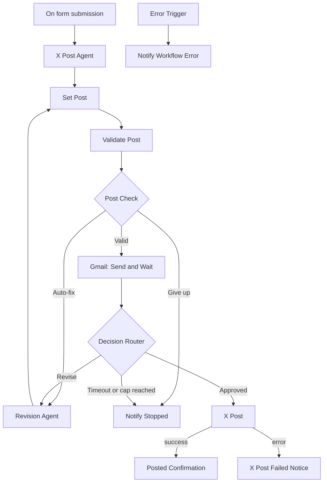

# X Post Agent with Approval

An **n8n** workflow that researches a topic, drafts an X (Twitter) post with AI, and publishes it **only after you approve it by email**. If you request changes, a second AI agent rewrites the post and sends it back for approval.


---

## Table of Contents

- [Features](#features)
- [How It Works](#how-it-works)
- [Workflow Diagram](#workflow-diagram)
- [Node Reference](#node-reference)
- [Approval Mechanism](#approval-mechanism)
- [Safety Limits](#safety-limits)
- [Error Handling](#error-handling)
- [Prerequisites](#prerequisites)
- [Setup](#setup)
- [Configuration](#configuration)
- [Usage](#usage)
- [Known Limitations](#known-limitations)
- [Project Structure](#project-structure)

---

## Features

- **Web form input**: submit a topic and choose a tone (Professional, Casual, Witty, Inspirational).
- **AI research and writing**: an agent searches the web with Tavily and writes one post of at most 280 characters.
- **Automatic validation**: empty or over-length posts are caught and auto-shortened before you ever see them.
- **Human approval**: a Gmail "Send and Wait" step pauses the run until you approve or request changes.
- **Deterministic routing**: a dropdown decides the path, so no AI interprets your reply.
- **Revision loop**: your feedback goes to a Revision Agent, and the new draft returns for approval.
- **Loop and cost protection**: a revision cap, a wait timeout and agent iteration limits.
- **Notifications**: success link, failure details, "stopped" notice and a workflow-error alert, all by email.

---

## How It Works

1. A user submits a **Topic** and **Tone** through an n8n form.
2. **X Post Agent** researches the topic and drafts a post.
3. The draft is cleaned and **validated** (non-empty, 280 characters or fewer).
4. A valid draft is emailed to the reviewer with a **Review post** button, and the workflow **pauses**.
5. The reviewer opens the form and picks **Approve** or **Request changes** (with optional feedback).
6. **Approve** publishes the post to X and emails the live link.
7. **Request changes** sends the feedback to the **Revision Agent**, and the loop repeats from step 3.

---

## Workflow Diagram



---

## Node Reference

| # | Node | Type | Purpose |
|---|------|------|---------|
| 1 | **On form submission** | Form Trigger | Entry point; collects `Topic` and `Tone`; responds to the visitor immediately |
| 2 | **X Post Agent** | AI Agent | Researches the topic (Tavily) and writes the first draft |
| 2a | GPT 4o-mini | OpenAI Chat Model | Language model for X Post Agent |
| 2b | Tavily Search | Tavily Tool | Web search tool for X Post Agent |
| 3 | **Set Post** | Set | Creates `post`, `revision` (loop counter via `$runIndex`) and `reviewerEmail` |
| 4 | **Validate Post** | Code (JavaScript) | Trims and strips quotes, counts characters, sets `valid`, `autoFix` and `feedback` |
| 5 | **Post Check** | Switch | Routes to **Valid**, **Auto-fix** or **Give up** |
| 6 | **Gmail** | Gmail (Send and Wait) | Emails the draft with a custom approval form and pauses the run |
| 7 | **Decision Router** | Switch | Routes to **Approved**, **Revise** or **Timeout or cap reached** |
| 8 | **Revision Agent** | AI Agent | Rewrites the post using your feedback or the length-check message |
| 8a | GPT 4o-mini2 | OpenAI Chat Model | Language model for Revision Agent |
| 8b | Tavily Search1 | Tavily Tool | Optional research tool for revisions |
| 9 | **X Post** | X (Twitter) | Publishes the latest approved post |
| 10 | **Posted Confirmation** | Gmail (Send) | Emails the live tweet link |
| 11 | **X Post Failed Notice** | Gmail (Send) | Emails the X API error and the post text |
| 12 | **Notify Stopped** | Gmail (Send) | Emails the last draft when the run ends without posting |
| 13 | **Error Trigger** | Error Trigger | Fires on unexpected workflow failures (production runs) |
| 14 | **Notify Workflow Error** | Gmail (Send) | Emails the failed node, error message and execution link |

---

## Approval Mechanism

- The **Gmail (Send and Wait)** node stores the execution in a waiting state; it uses no resources while paused.
- The email's button opens an n8n-hosted form with:
  - **Decision**: `Approve` or `Request changes` (required)
  - **Feedback**: free text (optional)
- The response resumes **only that execution**.
- **Decision Router** compares `data.Decision` with fixed values, so a vague comment can never trigger a publish.
- The only path to **X Post** is the **Approved** output.
- Every revision re-enters Set Post → Validate Post → Gmail, so you always approve the **actual final text**.

---

## Safety Limits

| Rule | Value | Enforced by |
|------|-------|-------------|
| Maximum post length | 280 characters | Validate Post |
| Automatic shorten attempts | while `revision < 4` | Validate Post |
| Maximum revision passes | while `revision < 5` | Decision Router |
| Maximum wait for a decision | 24 hours | Gmail node |
| Agent reasoning steps | 4 per run | Agent options |
| Retries (AI agents, X Post) | 3 | Node settings |

> The `revision` counter is shared: an automatic shorten uses one of the allowed passes.

---

## Error Handling

| Failure | Result |
|---------|--------|
| AI returns empty or too-long text | Auto-fix loop; **Notify Stopped** if it cannot be fixed |
| No reviewer response within 24 hours | **Notify Stopped** |
| Revision cap reached | **Notify Stopped** |
| X rejects the post (duplicate, rate limit, auth) | **X Post Failed Notice** |
| Any other node crashes | **Error Trigger** → **Notify Workflow Error** |

---

## Prerequisites

- An [n8n](https://n8n.io) instance (Cloud or self-hosted) with workflow publishing available
- Accounts and credentials for:

| Service | n8n credential type | Notes |
|---------|--------------------|-------|
| OpenAI | `OpenAI API` | Used by both agents (`gpt-4o-mini`) |
| Tavily | `Tavily API` | Web search for research |
| Gmail | `Gmail OAuth2` | Sending the approval, confirmation and alert emails |
| X (Twitter) | `X OAuth2` | Needs permission to **create posts** (write access); check your X API plan's posting limits |
| *(recommended)* HTTP Basic Auth | `Basic Auth` | Protects the public form |

---

## Setup

1. **Import** the workflow JSON into n8n (**Workflows → Import from File**), e.g. `x-post-agent-with-approval.json`.
2. **Assign credentials** to these nodes: GPT 4o-mini, GPT 4o-mini2, Tavily Search, Tavily Search1, Gmail, Posted Confirmation, X Post Failed Notice, Notify Stopped, Notify Workflow Error and X Post.
3. **Set your email**: edit the `reviewerEmail` value in **Set Post**, and the recipient in **Notify Workflow Error**.
4. **Protect the form** (recommended): create an `HTTP Basic Auth` credential and set it under **On form submission → Authentication → Basic Auth**.
5. **Test** with a manual run through the form and confirm that `data.Decision` is read correctly after you submit the approval form.
6. **Publish** the workflow to enable the production form URL.

---

## Configuration

| What to change | Where |
|----------------|-------|
| Reviewer email | **Set Post** → `reviewerEmail` |
| Tone options | **On form submission** → Tone dropdown |
| Max post length | **Validate Post** → `const MAX = 280` |
| Auto-shorten attempts | **Validate Post** → `MAX_AUTOFIX_REVISION` |
| Max revision passes | **Decision Router** → `Revise` rule (`< 5`) |
| Approval timeout | **Gmail** → Options → Limit Wait Time |
| AI model | **GPT 4o-mini** / **GPT 4o-mini2** |
| Writing style and rules | System message in **X Post Agent** / **Revision Agent** |
| Search depth and results | **Tavily Search** / **Tavily Search1** options |

---

## Usage

1. Open the form URL (production or test) and enter a **Topic** and **Tone**.
2. Wait for the approval email (subject: `Approve X Post (n/280 chars)`).
3. Click **Review post**, then choose:
   - **Approve** to publish the post to X, or
   - **Request changes** and describe what to fix.
4. After publishing, you receive an email with the link to the live post.

---

## Known Limitations

- **Character counting is approximate.** X weights URLs, emoji and some scripts differently from a simple code-point count.
- **The form is public** unless you enable Basic Auth.
- **Approval is link-based.** Anyone with access to the reviewer's inbox can approve.
- The Error Trigger alert only runs for **production** executions, not manual test runs.
- Web content passed to the AI is untrusted; the approval step is the safeguard, so keep it in place.

---

## Project Structure

```text
x-post-agent-with-approval/
├── README.md
└── x-post-agent-with-approval.json   # exported n8n workflow
```

---

## Tech Stack

n8n · OpenAI (`gpt-4o-mini`) · Tavily Search · Gmail API · X (Twitter) API

---

## License

Add your preferred license (for example MIT) before publishing.
